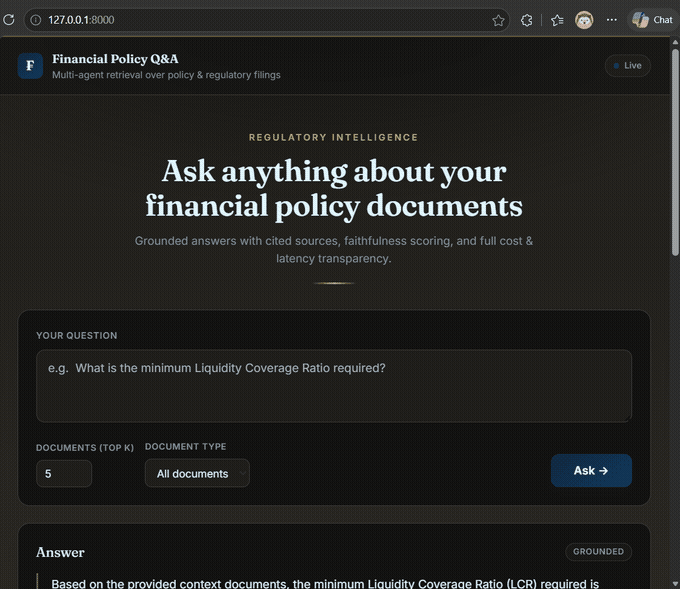

# Financial Policy Q&A — Multi-Agent RAG System

Production-grade RAG system for answering questions about financial policy and regulatory documents. Uses a multi-agent LangGraph workflow, hybrid dense+sparse retrieval, and live evaluation with Claude-as-judge.



---

## Highlights

| Metric | Result |
|---|---|
| Latency speedup vs single-chain baseline | **62% faster** (5.1s → 1.9s mean) |
| Answer relevancy (Claude-as-judge) | **96%** |
| Faithfulness (Claude-as-judge) | **100%** |
| Cost per query | ~$0.004 |
| Unit test coverage | 11/11 passing |

---

## Architecture

```
                       ┌──────────────────┐
        user query ──► │  FastAPI / Lambda │
                       └────────┬─────────┘
                                │
                       ┌────────▼─────────┐
                       │  LangGraph state  │
                       │  machine          │
                       └────────┬──────────┘
                                │
              ┌─────────────────┼─────────────────┐
              ▼                 ▼                 ▼
       ┌────────────┐   ┌──────────────┐   ┌────────────┐
       │ Retrieval  │──►│ Summarization│──►│ Validation │
       │ (hybrid)   │   │ (Bedrock)    │   │ (PII +     │
       │            │   │              │   │  hallucin.)│
       └─────┬──────┘   └──────┬───────┘   └─────┬──────┘
             │                 │                 │
             ▼                 ▼                 ▼
       ┌──────────┐      ┌──────────┐      ┌──────────┐
       │ Pinecone │      │ Bedrock  │      │ LangSmith│
       │ (dense + │      │ Claude 4 │      │ tracing  │
       │   BM25)  │      │          │      │          │
       └──────────┘      └──────────┘      └──────────┘
```

---

## Tech Stack

- **Orchestration:** LangGraph (multi-agent state machine)
- **Retrieval:** Pinecone with hybrid dense (Bedrock Titan embeddings) + sparse (BM25) and Reciprocal Rank Fusion reranking
- **Generation:** AWS Bedrock — Claude Sonnet 4 (`us.anthropic.claude-sonnet-4-20250514-v1:0`)
- **Evaluation:** RAGAS methodology implemented via Claude-as-judge
- **Observability:** LangSmith — per-node latency, token cost, hallucination scoring
- **Guardrails:** Regex-based PII redaction (email, SSN, phone, card)
- **API:** FastAPI + Mangum adapter for AWS Lambda + API Gateway
- **Testing:** PyTest (11 tests), Locust (load test)
- **CI/CD:** GitHub Actions with RAGAS quality gates that auto-block merges if answer relevancy drops

---

## Multi-Agent Workflow

1. **Retrieval Agent** — Hybrid Pinecone search returns top-K chunks
2. **Summarization Agent** — Bedrock Claude generates a grounded answer with strict context-only system prompt
3. **Validation Agent** — Redacts PII and computes a 0-1 hallucination score by re-asking Claude how grounded the answer is in the source docs

Every node is traced in LangSmith with latency and token cost.

---

## Document-Type-Aware + Strategy-Aware Chunking

Three configurable chunking strategies (benchmarked via `scripts/compare_chunking.py`):

| Strategy | When to use |
|---|---|
| **fixed-size** | Fast baseline; uniform chunks |
| **hierarchical** | Default; respects headings → paragraphs → sentences |
| **sentence-window** | Highest precision; each chunk = sentence + N neighbors |

Chunk sizes adjusted per document type:

| Doc type | Chunk size |
|---|---|
| `regulation` | 256 tokens (precise regulatory text) |
| `policy` | 512 tokens |
| `report` | 1024 tokens (long annual reports) |

---

## Quick Start

### Prerequisites

- Python 3.11
- AWS account with Bedrock access (Claude Sonnet 4)
- Pinecone account (free tier works)
- LangSmith account (optional but recommended)

### Setup

```bash
# Clone and install
git clone https://github.com/nehashirodkar/financial-policy-qa.git
cd financial-policy-qa
pip install -r requirements.txt

# Configure secrets
cp .env.example .env
# fill in AWS keys, Pinecone API key, LangSmith key

# Ingest sample documents into Pinecone
python scripts/ingest.py

# Start the API
uvicorn app.main:app --reload
```

### Make a query

```bash
curl -X POST http://127.0.0.1:8000/query \
  -H "Content-Type: application/json" \
  -d '{"query": "What is the minimum Liquidity Coverage Ratio required?"}'
```

---

## Benchmarks

```bash
# Latency: multi-agent vs single-chain baseline
python scripts/benchmark.py --n 5

# Retrieval quality: dense-only vs hybrid
python scripts/compare_retrieval.py --n 5

# Chunking strategy comparison
python scripts/compare_chunking.py --n 5

# Load test
locust -f scripts/load_test.py --headless -u 10 -r 2 --run-time 30s --host http://127.0.0.1:8000
```

---

## Tests

```bash
pytest tests/ -v
```

11 tests cover all 3 agents (with mocked Bedrock/Pinecone) and the chunking strategies.

---

## CI/CD Quality Gates

`.github/workflows/quality-gate.yml` runs on every PR:

1. Unit tests must pass
2. RAGAS evaluation runs against the golden test set
3. PR is **blocked** if `answer_relevancy < 0.80` or `faithfulness < 0.85`

This prevents regressions in retrieval/prompt changes from silently degrading quality.

---

## Deployment

Two deployment options included:

- **AWS SAM** (`template.yaml`) — Lambda + API Gateway with environment-variable injection
- **Docker** (`deploy/Dockerfile`) — container image deployable to Lambda or ECS

```bash
# Deploy via SAM
sam build && sam deploy --guided
```

---

## Project Structure

```
app/
├── agents/          # Retrieval, summarization, validation specialists
├── graph/           # LangGraph state schema + workflow
├── retrieval/       # Pinecone client, hybrid search, chunking strategies
├── guardrails/      # PII redaction
├── tracing/         # LangSmith integration, hallucination scoring
├── schemas/         # Pydantic models
└── main.py          # FastAPI app + Mangum Lambda handler

scripts/
├── ingest.py            # Ingest documents to Pinecone
├── baseline.py          # Single-chain (no multi-agent) baseline
├── benchmark.py         # Latency comparison
├── compare_retrieval.py # Dense vs hybrid quality comparison
├── compare_chunking.py  # Chunking strategy comparison
└── load_test.py         # Locust load test

tests/
├── test_agents.py       # Agent unit tests with mocked Bedrock/Pinecone
└── test_retrieval.py    # Chunking strategy tests

.github/workflows/
└── quality-gate.yml     # CI: pytest + RAGAS quality gate
```

---

## License

MIT
